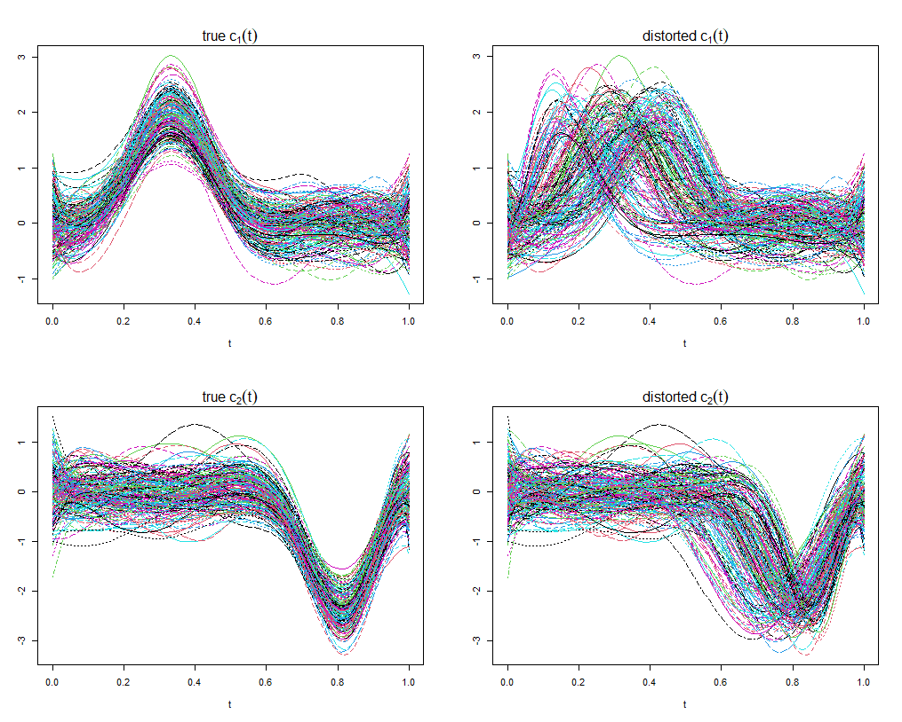
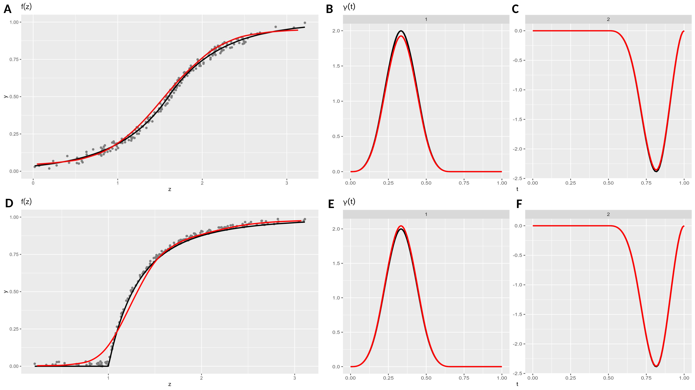

# BMSQRM: Bayesian Monotone Single-index Quantile Regression Model with Bounded Responses and Misaligned Functional Covariates

# Introduction
## Abstract
**Existing mental health research indicates that increasing depressive symptoms in adolescents are linked to a parental history of depression, current anxiety, depressive symptoms, and other behavioral problems. Our objective is to explore the association between these scalar variables and multiple functional covariates measuring neural response to rewards with future adolescent depression. Unlike previous studies that employed simple linear regression to account for all covariates, we introduce a novel Bayesian quantile regression model. This model utilizes a single-index summary of all scalar and functional covariates, paired with a monotone link function to accommodate unknown functional forms and interactions among covariates. Our method addresses several practical challenges not covered by existing methods: it provides an index with clinical interpretability similar to a linear model, ensures the fitted value of the pre-specified quantile remains within the same bounds as the response, and accounts for the uncertainty in the registration of observed functional covariates during data analysis. In our simulation study, our method outperforms existing unrestricted single-index models in the presence of both scalar and pre-registered functional covariates. Additionally, we demonstrate the practical benefits and implications of our method by analyzing data from a large adolescent depression study, leading to a new statistically principled summary of the functional covariates measuring neural response to rewards.**


# Code Usage

## 1. File Structure
- **[simu_main.R](simu_main.R):**
  - the main function for implementing the simulation analysis
- **[simu_data_gen.R](simu_data_gen.R)**
  - the main function for generating the simulation dataset
- **[main_process.R](main_process.R):** 
  - the main algorithm for our method BMSQRM, containing iterative (registration + MCMC Sampling)
- **[MCMC_sampling.R](MCMC_sampling.R):**
  - the main functions for MCMC Sampling 
- **[logLikelihood.cpp](logLikelihood.cpp):**
  - the function for computing the log-likelihood, written in C++ for speed-up
- **[utilities.R](utilities.R):** 
  - contains all other user-defined helper functions
- **[./figures/](./figures/)**
  - [curves_generation_spike_slab.png](./figures/curves_generation_spike_slab.png): the illustration of curve generating process
  - [simu_fz_gamma_examples.png](./figures/simu_fz_gamma_examples.png): the visualization of fitted link function and estimated functional coefficients in Simulation Analysis


## 2. Usage of [main_process.R](main_process.R):
### Required Libraries
```
pracma
fda
fdasrvf
GIGrvg
MfUSampler
Rcpp
coda
ald
ggplot2
KernSmooth
```

### Input Structure:
- **x**: scalar predictors, (p,n)
- **y**: response, (n)
- **curves**: functional predictors, (N, n, nf)
- **t**: index of the curves, (N)
- **tau**: the quantile level to be examined
- **registration**: bool, if conduct the registration iteratively together with MCMC
- **srvf.lambda**: control the level of penalty in the elastic registration
- **showplot.srvf**: bool, visualize the detailed process of registration
- **curves.template**: the template used in the elastic registration,
    - a matrix (N, nf),
    - or vector (nf) of integers denoting the index of curves as the template
    - or string "median"/"mean" denoting the Karcher Median/Mean as the template
- **norder**: the order of B-Splines for the functional coeffficients
- **nbasis**: the number of basis of B-Splines for the functional coefficients
- **K**: the number of gaussian cdfs used in estimating the link function
- **seed**: for random number generator
- **n.chains**: the number of MCMC chains to obtain the estimators
- **Nsamples**: the number of samples obtained in each chain
- **slice.w**: the window size in the slice sampler, a scalar or a list of window size for each parameter
- **slice.m**: the max number of steps within the slice sampler

#### Hyperparamters:
- **a.sigma, b.sigma**: the prior of sigma
- **a.DP**: the prior of B
- **mean.mu, sd.mu**: the prior of each mu_j in mixture gaussian cdf
- **shape.xi, scale.xi**: the prior of each xi_j in mixture gaussian cdf
- **scale.eta**: the parameter in the prior of eta_{k,b}

#### Others
- **burnin & thinning**: number of samples to discard and thinning in each chain
- **psrf, autocorr, trace, density, effsize, effsize.fz**: bool, for chain diagnosis, check R package "coda" for more details
- **max_iters**: the max number of iterations for the whole process
- **save.samples**: bool, whether to save all the samples in each chain, (will always save the effective samples)
- **r**: the constraint (2-norm) of scalar coefficients
- **p.kl**: in (0,1), control the sparsity level of beta

#### Note:
    n: sample size
    N: number of grids for curves
    p: number of scalar predictors
    nf: number of functional predictors

### Output Structure:
> **a list containing the following attributes:**
- > **res.list0: a list containing the final estimates after convergence**
  -  res0: a list containing the effective samples and Bayesian estimates for each chain
    - all.chains: a list containing the mcmc chains after burnin & thinning for each chain
    - all.estimators: a list containing the Bayesian estimates for each chain
  - paras.init: a list containing the initial values for each parameter
  - sigma.est
  - theta.est
  - alpha.est
  - beta.est
  - z.est
  - fz.est
  - b.est
  - mu.est
  - xi.est
- **iters**: the number of iterations running (registration + MCMC) procedure
- **all.alpha.est**: a (iters, p) matrix, each row contains $\hat{\boldsymbol{\alpha}}$ after one iteration of (registration + MCMC) procedure
- **all.beta.est**: a (iters, nbasis*nf) matrix, each row contains $\hat{\boldsymbol{\beta}}$ after one iteration of (registration + MCMC) procedure
- **all.gamma.est**: a (N, nf, iters) array, each slice contains $(\hat{\gamma}_1(t), \hat{\gamma}_2(t))$ after one iteration of (registration + MCMC) procedure
- **all.curves.reg**: a list containing the registered curves for each iteration 
- **all.z.est**: a (iters, n) matrix, each row contains $\hat{z}_i, i=1,\ldots,n$ after one iteration of (registration + MCMC) procedure
- **all.fz.est**: a (iters, n) matrix, each row contains $\hat{f}(\hat{z}_i), i=1,\ldots, n$ after one iteration of (registration + MCMC) procedure


## 3. An Example of Simulation Analysis: **[simu_main.R](simu_main.R)**
### (a) Arguments:
- n: sample size
- N: number of grids
- tau: target quantile level
- func.p: bool, whether include functional covariates
- fz.idx: choice of link function
  - fz.idx = 1: CDF of Gaussian distribution
  - fz.idx = 2: CDF of Laplace distribution
  - fz.idx = 3: CDF of Pareto distribution
- K: number of mixture gaussian cdfs used to model the link function
- n.chains: number of MCMC chains in each iteration
- Nsamples: number of samples to draw from each chain
- burnin
- thinning
- max_iters: maximum number of iterations running (registration + MCMC) procedure
- jobid: an index for replication purpose & parallel computing, used as the seed in data generation
- save.samples: bool, if save all the samples or only the effecitve samples after burnin & thinning
- visualize.results: bool, if generate the visualization of $(\hat{\gamma}_1(t), \hat{\gamma}_2(t))$ and $\hat{f}(\hat{z}_i), i=1,\ldots, n$. 

> **The following arguments will only be used while existing functional covariates, i.e., func.p = TRUE**
- nbasis: number of B-Spline basis for the functional coefficients
- nf: number of functional covariates
- p.kl: the prior parameter controlling the sparsity of functional coefficients
- registration: bool, wheter to conduct (registration + MCMC) or only MCMC
- srvf.lambda: a scalar in (0,1), controlling the smoothness in the registration step
  

### (b) Examples of Usage
#### (i) Simulation Setting I.2 described in the paper, <mark> only scalar covariates<mark>
> n = 200, N = 100, tau = 0.50, func.p = FALSE, fz.idx = 2 (Laplace CDF), K = 10, n.chains = 1, Nsamples = 1E5, burnin = 5E4, thinning = 20, max_iters = 5, jobid = 1, save.samples = FALSE, visualize.results = FALSE, nbasis = 9, nf = 2, p.kl = 0.5, registration = FALSE, srvf.lambda = 0.05 

```ruby
R CMD BATCH simu_main.R 200 100 0.5 FALSE 2 10 1 1E5 5E4 20 5 1 FALSE FALSE 9 2 0.5 TRUE 0.05
```

#### (ii) Simulation Setting II.1 described in the paper, <mark> both scalar and functional covariates<mark>
> n = 200, N = 100, tau = 0.75, func.p = TRUE, fz.idx = 2 (Laplace CDF), K = 10, n.chains = 1, Nsamples = 1E5, burnin = 6E4, thinning = 100, max_iters = 5, jobid = 1, save.samples = FALSE, visualize.results = TRUE, nbasis = 9, nf = 2, p.kl = 0.5, registration = TRUE, srvf.lambda = 0.05 

```ruby
R CMD BATCH simu_main.R 200 100 0.75 TRUE 2 10 1 1E5 6E4 100 5 1 FALSE TRUE 9 2 0.5 TRUE 0.05
```

#### (iii) Simulation Setting II.2 described in the paper, <mark> both scalar and functional covariates, **without registration**<mark>
> n = 200, N = 100, tau = 0.50, func.p = TRUE, fz.idx = 3 (Pareto CDF), K = 10, n.chains = 1, Nsamples = 1E5, burnin = 6E4, thinning = 100, max_iters = 5, jobid = 1, save.samples = FALSE, visualize.results = TRUE, nbasis = 9, nf = 2, p.kl = 0.5, registration = FALSE, srvf.lambda = 0.05 

```ruby
R CMD BATCH simu_main.R 200 100 0.5 TRUE 3 10 1 1E5 6E4 100 5 1 FALSE TRUE 9 2 0.5 FALSE 0.05
```

 
### (c) Visualization
#### (a) Illustration of curve generating process 



Fig 1. **Left Panel:** the perfectly warped curves $\{c_{1,i}^{(0)}\}_{i=1}^n$ and $\{c_{2,i}^{(0)}\}_{i=1}^n$ as the true functional covariates; **Right Panel:** the distorted curves $\{c_{1,i}(t)\}_{i=1}^n$ and $\{c_{2,i}(t)\}_{i=1}^n$ as the ``observed" functional covariates, where $c_{k,i}(t) = c^{(0)}_{k,i} \odot \tilde{h}_{k,i}(t)$, and the random warping function was defined as $\tilde{h}_{k,i}(t) = t^{u_{k,i}}$ with $u_{k,i} \sim U(0.5,1.5)$ for $k=1,2$ and $i=1, \dots, n$.

#### (b) Visualization of simulation results with two functional covariates


Fig 2. Comparing estimated link  $\widehat{f}(z)$ and   $\hat{\gamma}_k(t), k=1,2$ (red curves) with the corresponding true link $f$ and true functional coefficients (black curves). The top row plots (Panel A-C) correspond to _Setting II.1_ while the bottom row plots (Panel D-F) correspond to _Setting II.2_.
